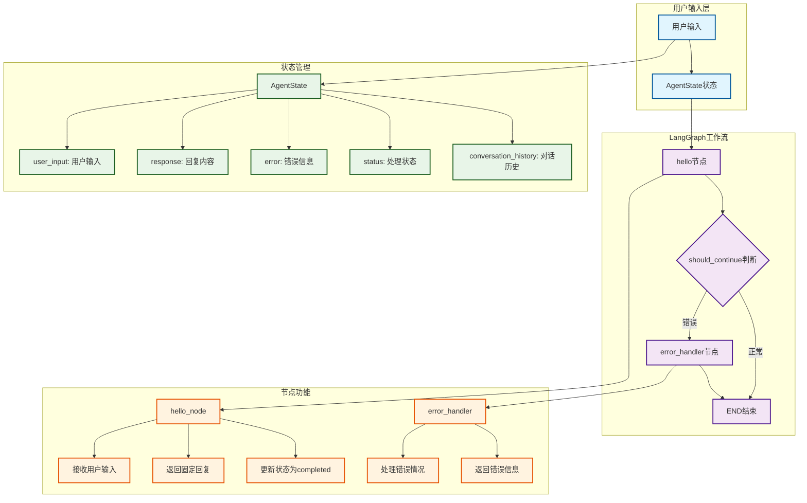
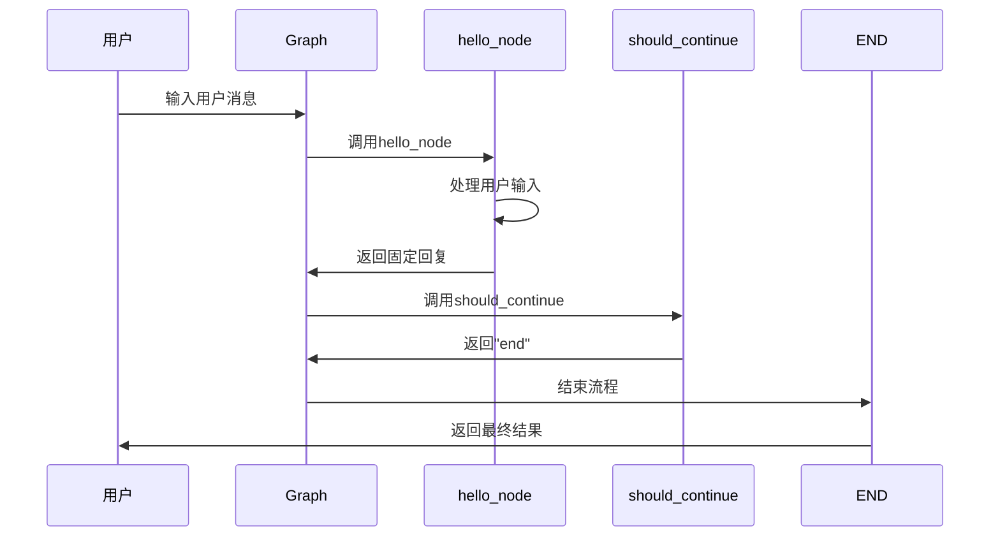

# 🤖 StockAI Agent 架构文档

## 概述

本文档描述了StockAI项目的核心后端Agent架构，基于LangGraph框架实现。

## 架构图



## 核心组件

### 1. 状态定义 (state.py)

```python
class AgentState(TypedDict):
    user_input: str          # 用户输入
    response: str            # 处理结果
    error: Optional[str]     # 错误信息
    status: str              # 处理状态
    conversation_history: List[dict]  # 历史对话
```

### 2. 核心节点 (agent.py)

#### hello_node
- **功能**: 基础回答节点，默认回复"Hello! 我是StockAI助手，很高兴为您服务！"
- **特点**: 不调用大语言模型，直接返回固定回复
- **输入**: AgentState
- **输出**: 更新response、status、error字段

#### error_handler
- **功能**: 错误处理节点
- **特点**: 处理异常情况，返回错误信息
- **输入**: AgentState
- **输出**: 错误响应信息

#### should_continue
- **功能**: 条件判断函数
- **逻辑**: 根据状态决定是否继续处理或进入错误处理

### 3. 工作流图构建

```python
def create_graph() -> StateGraph:
    workflow = StateGraph(AgentState)
    
    # 添加节点
    workflow.add_node("hello", hello_node)
    workflow.add_node("error_handler", error_node)
    
    # 设置入口点
    workflow.set_entry_point("hello")
    
    # 添加条件边
    workflow.add_conditional_edges("hello", should_continue, {
        "end": END,
        "error": "error_handler"
    })
    
    # 错误节点直接结束
    workflow.add_edge("error_handler", END)
    
    return workflow
```

## 执行流程



## 测试用例

已通过以下测试用例验证：

1. **正常输入测试**: 输入"你好，我想了解股票信息"
   - 预期: 返回"Hello! 我是StockAI助手，很高兴为您服务！"
   - 状态: completed

2. **空输入测试**: 输入空字符串
   - 预期: 同样返回固定回复
   - 状态: completed

3. **长文本输入测试**: 输入长文本查询
   - 预期: 返回固定回复
   - 状态: completed

## 技术特点

### 优势
- ✅ **简单可靠**: 不依赖外部API，响应稳定
- ✅ **快速响应**: 无网络延迟，即时回复
- ✅ **易于扩展**: 基于LangGraph框架，便于添加新节点
- ✅ **状态管理**: 完整的状态跟踪和错误处理

### 设计原则
- 🎯 **最小化实现**: 满足基础功能需求即可
- 🔧 **模块化设计**: 节点功能独立，便于维护
- 🛡️ **错误处理**: 完善的异常处理机制
- 📈 **可扩展性**: 为后续功能扩展预留接口

## 后续扩展计划

1. **股票数据查询节点**: 集成AKShare API
2. **技术分析节点**: 添加技术指标计算
3. **智能回复节点**: 集成大语言模型
4. **图表生成节点**: 添加可视化功能
5. **历史记录节点**: 实现对话历史管理

## 文件结构

```
my_agent/
├── __init__.py          # 包初始化
├── agent.py            # 核心Agent实现
├── state.py            # 状态定义
├── tools/              # 工具模块
│   ├── __init__.py
│   ├── akshare_client.py
│   └── analysis_tools.py
└── frontend/           # 前端模块
    ├── __init__.py
    └── gradio_app.py
```

## 运行方式

```bash
# 激活环境
conda activate open_manus

# 通过LangGraph Studio运行
langgraph dev

# 或直接导入使用
from my_agent.agent import graph
result = graph.invoke({"user_input": "你好"})
```
