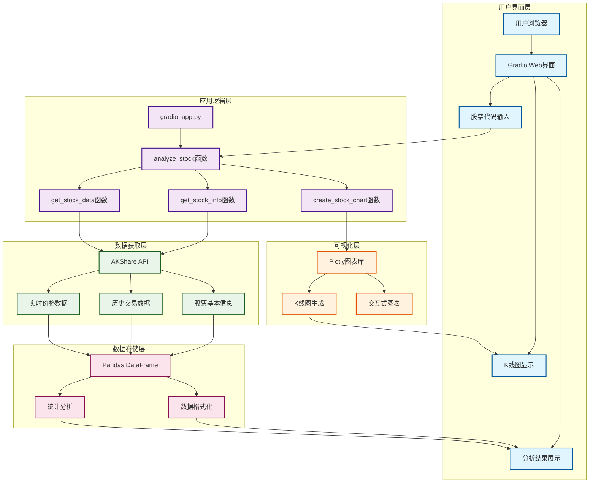
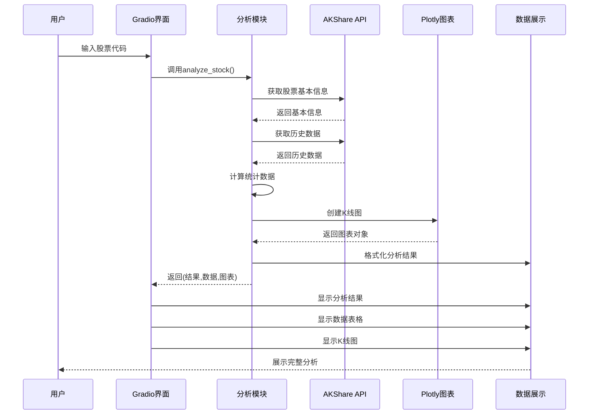
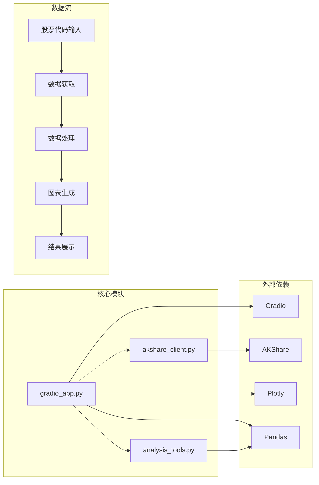

# 🏗️ StockAI 前端架构图

## 系统架构

## 数据流程图

## 模块依赖关系

## 技术栈说明

### 前端技术
- **Gradio 5.44.1**: 现代化Web界面框架
- **Plotly 6.3.0**: 交互式图表库
- **响应式CSS**: 适配不同设备

### 数据处理
- **Pandas 2.2.3**: 数据分析和处理
- **NumPy 2.2.5**: 数值计算
- **AKShare 1.16.84**: 中国股市数据API

### 开发环境
- **Python 3.12**: 运行环境
- **Conda**: 环境管理
- **open_manus**: 项目环境

## 性能优化

### 数据缓存
- 股票基本信息缓存
- 历史数据本地存储
- 图表对象复用

### 异步处理
- 非阻塞数据获取
- 后台数据处理
- 实时更新机制

### 用户体验
- 加载状态提示
- 错误处理机制
- 快速测试功能
