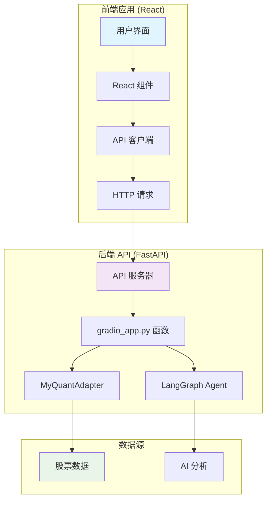

# StockAI 前端开发指南

## 概述

本项目已创建了一个基于 React + TypeScript + Vite 的前端应用，完全替代了原来的 Gradio 界面。前端参照 valuecell 项目的 UI/UX 设计，提供了现代化的用户界面。

## 架构说明



## 启动步骤

### 1. 安装前端依赖

```bash
cd frontend
npm install
```

### 2. 启动后端 API 服务器

在项目根目录：

```bash
conda activate open_manus
python start_frontend_api.py
```

后端 API 将在 http://localhost:8000 启动

### 3. 启动前端开发服务器

在 `frontend` 目录：

```bash
npm run dev
```

前端应用将在 http://localhost:3000 启动

### 4. 访问应用

打开浏览器访问：**http://localhost:3000**

## 文件说明

### 前端文件结构

```
frontend/
├── src/
│   ├── api/              # API 接口定义
│   ├── app/              # 主页面组件
│   ├── components/      # UI 组件
│   ├── lib/              # 工具函数
│   └── types/            # TypeScript 类型
├── api_server.py         # FastAPI 后端（已移至根目录）
└── package.json          # 依赖配置
```

### 后端 API 文件

- `api_server.py` - FastAPI 服务器，暴露 Python 功能为 REST API
- `start_frontend_api.py` - 启动脚本

## 主要功能

### 1. 股票分析

- 输入股票代码（支持多只，用逗号分隔）
- 选择时间间隔（日线/分钟线）
- 显示分析结果（Markdown 格式）
- 显示历史数据表格
- 显示多股票涨跌幅对比图表

### 2. 对话助手

- 与 LangGraph Agent 实时对话
- 支持对话历史记录
- Markdown 格式回复

## API 接口

### POST /api/stock/analyze

分析股票数据

**请求：**
```json
{
  "stock_code": "SZSE:000001,SSE:600036",
  "interval": "1d"
}
```

**响应：**
```json
{
  "analysis_text": "## 股票分析结果...",
  "data_table": [...],
  "chart_data": {
    "dates": ["2024-01-01", ...],
    "stocks": [
      {
        "code": "SZSE:000001",
        "returns": [0, 1.2, -0.5, ...]
      }
    ]
  }
}
```

### POST /api/chat

与 Agent 对话

**请求：**
```json
{
  "message": "你好",
  "history": [
    {"role": "user", "content": "之前的问题"},
    {"role": "assistant", "content": "之前的回答"}
  ]
}
```

**响应：**
```json
{
  "message": "助手回复"
}
```

## 开发建议

### 添加新功能

1. 在 `src/api/` 中添加 API 接口定义
2. 在 `src/components/` 中创建 UI 组件
3. 在 `src/app/` 中集成到主页面
4. 在 `api_server.py` 中添加对应的后端接口（如需要）

### 样式修改

- 修改 `src/index.css` 中的 CSS 变量
- 使用 Tailwind CSS 类名
- 参照 valuecell 项目的设计风格

### 调试

- 前端：使用浏览器开发者工具
- 后端：查看 API 服务器日志
- API 文档：访问 http://localhost:8000/docs

## 注意事项

1. 确保后端 API 服务器先启动
2. 检查 `.env` 文件中的 API 地址配置
3. 前端需要安装所有依赖（`npm install`）
4. 后端需要安装 FastAPI 相关依赖

## 与 Gradio 版本的对比

| 特性 | Gradio 版本 | React 版本 |
|------|------------|-----------|
| 技术栈 | Python + Gradio | React + TypeScript |
| UI 框架 | Gradio | React + Tailwind |
| 图表库 | Plotly | ECharts |
| 部署 | Python 服务器 | 静态文件 + API 服务器 |
| 可定制性 | 中等 | 高 |
| 性能 | 良好 | 优秀 |

## 下一步

- [ ] 添加更多图表类型（K线图、成交量图等）
- [ ] 添加数据导出功能
- [ ] 优化移动端体验
- [ ] 添加用户设置（主题、语言等）
- [ ] 添加数据缓存和离线支持

