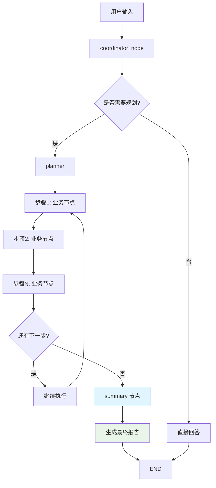

# Summary 节点实现总结

## 🎯 实现目标
在 `agent.py` 中新增 summary 节点，用于对 planner 的所有任务结果进行总结并最终输出给用户。

## ✅ 完成的工作

### 1. 修改 planner 函数
- **返回类型扩展**: 在 `planner` 函数的返回类型中添加了 `'summary'` 选项
- **流程优化**: 当所有计划步骤完成时，不再直接返回 `END`，而是跳转到 `summary` 节点

### 2. 新增 summary 节点
- **功能**: 收集所有任务结果并生成专业的投资分析报告
- **输入**: 用户原始需求 + 所有已完成步骤的结果
- **输出**: 结构化的 Markdown 格式报告

### 3. 报告结构设计
```markdown
# 📊 股票分析报告

## 📋 执行摘要
- 简要概述所有任务的核心发现

## 🔍 关键发现  
- 列出3-5个最重要的发现和结论

## 💡 投资建议
- 提供3-5条具体的投资建议

## ⚠️ 风险提示
- 列出需要注意的风险点（如有）

## 📈 后续关注
- 建议用户后续关注的事项

## 📊 详细分析
- 对各个任务结果进行深入分析

---
*报告生成时间：YYYY-MM-DD HH:MM:SS*
*基于 N 个分析任务的结果生成*
```

### 4. 工作流集成
- **节点添加**: 在 `create_graph()` 中添加了 `summary` 节点
- **动态路由**: 通过 `Command` 实现从 `planner` 到 `summary` 的动态跳转
- **流程闭环**: 形成完整的 规划 → 执行 → 总结 → 结束 流程

## 🔄 新的工作流程



## 🧪 测试验证

### 测试结果
- ✅ 图创建成功
- ✅ Summary 节点执行正常
- ✅ 报告生成格式正确
- ✅ 包含所有必要的信息结构

### 测试用例
使用模拟的3个已完成任务：
1. 获取今日市场新闻
2. 分析热门板块  
3. 识别龙头股票

生成的报告包含：
- 执行摘要
- 5个关键发现
- 5条投资建议
- 4个风险提示
- 详细的综合分析

## 📈 功能特点

### 1. 智能总结
- 基于所有任务结果进行综合分析
- 提取关键信息形成可操作建议
- 识别潜在风险并提供风险提示

### 2. 专业报告
- 结构化的 Markdown 格式
- 包含时间戳和任务统计
- 专业的投资分析报告风格

### 3. 用户友好
- 清晰的章节划分
- 易于阅读的格式
- 具体的操作建议

### 4. 可扩展性
- 支持多种分析任务的综合总结
- 灵活的报告结构
- 易于添加新的分析维度

## 🚀 使用方式

1. 用户提出问题
2. coordinator_node 判断需要规划
3. planner 制定执行计划
4. 各业务节点依次执行任务
5. 所有任务完成后自动跳转到 summary
6. summary 生成最终报告并结束

## 📝 代码变更

### 主要文件修改
- `stockai/agent.py`: 添加 summary 节点和相关逻辑
- 新增文件: `summary_workflow_diagram.md` (流程图)
- 新增文件: `SUMMARY_NODE_IMPLEMENTATION.md` (本文档)

### 关键代码片段
```python
def summary(state: AgentState) -> Command[Literal[END]]:
    """总结节点：收集所有任务结果并生成最终报告"""
    # 收集已完成步骤的结果
    completed_steps = [step for step in current_plan if step.status == "completed"]
    
    # 生成专业报告
    # ... 报告生成逻辑
    
    return Command(goto=END, update=final_report)
```

## ✨ 总结

成功实现了 summary 节点，为 StockAI 项目添加了完整的任务总结功能。该节点能够：

1. **收集所有任务结果** - 自动汇总所有已完成步骤的输出
2. **生成专业报告** - 创建结构化的投资分析报告  
3. **提供操作建议** - 基于分析结果给出具体建议
4. **识别风险点** - 提醒用户注意潜在风险
5. **完善工作流程** - 形成规划→执行→总结的完整闭环

这个实现大大提升了用户体验，让用户能够获得所有分析任务的综合总结，而不是分散的单个任务结果。
