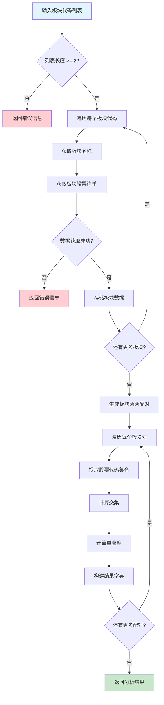

# analyze_concepts_overlap 函数工作流程

## 函数功能
分析概念板块列表中的两两重叠度，返回详细的板块重叠信息。

## 工作流程图



## 核心算法

### 重叠度计算公式
```
重叠度 = 交集股票数量 / min(板块1股票数量, 板块2股票数量)
```

### 返回结果格式
```json
{
    "分析结果": "成功分析 X 个板块的 Y 对重叠关系",
    "板块对重叠度": [
        {
            "板块1代码": "BK0709",
            "板块1名称": "赛马概念",
            "板块2代码": "BK1093", 
            "板块2名称": "汽车一体化压铸",
            "重叠度": 0.0,
            "重叠股票数量": 0,
            "板块1股票数量": 3,
            "板块2股票数量": 30
        }
    ]
}
```

## 测试用例验证

### 测试用例1：正常情况
- 输入：["BK0709", "BK1093"]
- 结果：成功分析2个板块的1对重叠关系
- 重叠度：0.0（无重叠）

### 测试用例2：错误处理
- 输入：["BK0709"]（不足2个板块）
- 结果：返回错误信息

### 测试用例3：多个板块
- 输入：["BK0709", "BK1093", "BK0671"]
- 结果：成功分析3个板块的3对重叠关系
- 配对数量：C(3,2) = 3对

## 关键特性

1. **错误处理**：完善的异常处理机制
2. **数据验证**：输入参数验证
3. **性能优化**：使用缓存机制
4. **结果详细**：包含板块名称、重叠度、股票数量等详细信息
5. **格式统一**：返回标准化的字典格式
