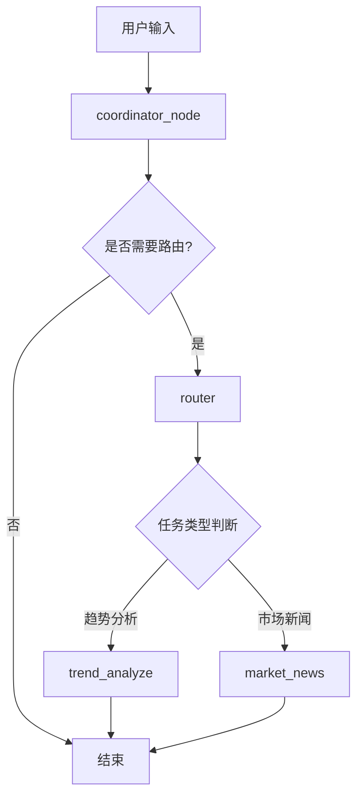

# 优化后的 StockAI 架构图

## 工作流程图

## 节点说明

1. **coordinator_node**: 协调器节点
   - 处理简单问候和对话
   - 判断是否需要转给 router
   - 如果需要复杂分析，转给 router

2. **router**: 智能路由器
   - 分析用户输入内容
   - 判断任务类型（趋势分析 vs 市场新闻）
   - 使用 Command 控制边到对应节点

3. **trend_analyze**: 趋势分析子代理
   - 处理股票走势、技术分析相关问题
   - 使用 akshare 工具获取股票数据
   - 进行技术分析和趋势判断

4. **market_news**: 市场新闻子代理
   - 处理市场新闻、政策消息相关问题
   - 获取和分析市场动态

## 优化内容

1. ✅ 导入了 `trend_analyze` 函数
2. ✅ 将 `should_continue` 替换为 `router` 函数
3. ✅ `router` 函数使用 LLM 智能判断任务类型
4. ✅ 更新了图结构，添加了 `trend_analyze` 节点
5. ✅ **优化**: router 使用 Command 控制边到对应节点，不在内部直接调用子代理
6. ✅ **优化**: 子代理节点直接处理任务并返回结果
7. ✅ **优化**: 图结构更清晰，每个节点职责更单一

## 优化优势

- **符合 LangGraph 设计理念**: 使用 Command 控制流程，而不是内部调用
- **图结构更清晰**: 每个节点都有明确的输入输出
- **便于调试和监控**: 可以清楚看到每个节点的执行情况
- **职责分离**: router 只负责路由，子代理只负责处理具体任务
