# Agent.py 工作流更新说明

## 更新概述

成功将 `analyze_stocks_similiarity` 节点添加到 `agent.py` 工作流中，现在该节点可以与其他节点协同工作。

## 更新内容

### 1. 导入语句更新
```python
from stockai.subagents.market import market_news, get_proper_concept, analyze_leading_stocks, analyze_stocks_similiarity
```

### 2. Planner 函数类型定义更新
```python
def planner(state: AgentState) -> Command[Literal['trend_analyze', 'market_news', 'get_proper_concept', 'analyze_leading_stocks', 'analyze_stocks_similiarity', END]]:
```

### 3. 节点能力描述添加
在 planner 的两个系统提示中都添加了 `analyze_stocks_similiarity` 节点的能力描述：

```
## analyze_stocks_similiarity
- 股票基本信息获取：股票名称、主营业务、市值等
- K线相似度计算：计算股票与龙头股的K线走势相似度
- 主营业务相似度分析：比较股票与龙头股的主营业务相似度
- 综合相似度排序：结合K线和主营业务相似度进行综合排序
- 多维度相似度评估：从技术面和基本面两个维度评估相似度
```

### 4. 图节点添加
```python
workflow.add_node('analyze_stocks_similiarity', analyze_stocks_similiarity)
```

### 5. 边连接添加
```python
workflow.add_edge("analyze_stocks_similiarity", "planner")
```

## 工作流程图

```mermaid
graph TD
    A[用户输入] --> B[coordinator_node]
    B --> C{是否需要规划?}
    C -->|是| D[planner]
    C -->|否| E[END]
    
    D --> F{选择执行节点}
    F -->|趋势分析| G[trend_analyze]
    F -->|市场新闻| H[market_news]
    F -->|板块选择| I[get_proper_concept]
    F -->|龙头股分析| J[analyze_leading_stocks]
    F -->|股票相似度分析| K[analyze_stocks_similiarity]
    
    G --> D
    H --> D
    I --> D
    J --> D
    K --> D
    
    D --> L{所有步骤完成?}
    L -->|是| E
    L -->|否| F
```



## 节点功能说明

### analyze_stocks_similiarity 节点功能
- **股票基本信息获取**：获取股票的名称、主营业务、市值等基础信息
- **K线相似度计算**：计算目标股票与龙头股的K线走势相似度
- **主营业务相似度分析**：比较股票与龙头股的主营业务相似度
- **综合相似度排序**：结合K线和主营业务相似度进行综合排序
- **多维度相似度评估**：从技术面和基本面两个维度评估相似度

## 使用场景

该节点通常用于以下场景：
1. 选股分析：根据龙头股特征寻找相似的潜力股票
2. 板块轮动：分析板块内股票的相似性
3. 投资组合构建：基于相似度构建投资组合
4. 风险控制：识别与龙头股高度相似的股票

## 测试建议

建议测试以下场景：
1. 正常相似度分析流程
2. 不同股票列表的相似度计算
3. 与龙头股分析节点的协同工作
4. 错误处理和异常情况
5. 不同时间周期的K线相似度分析
