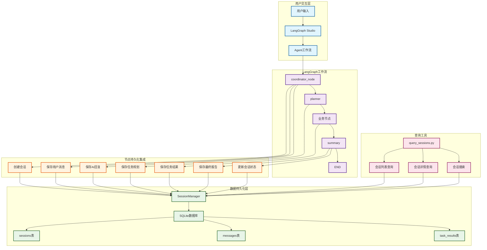
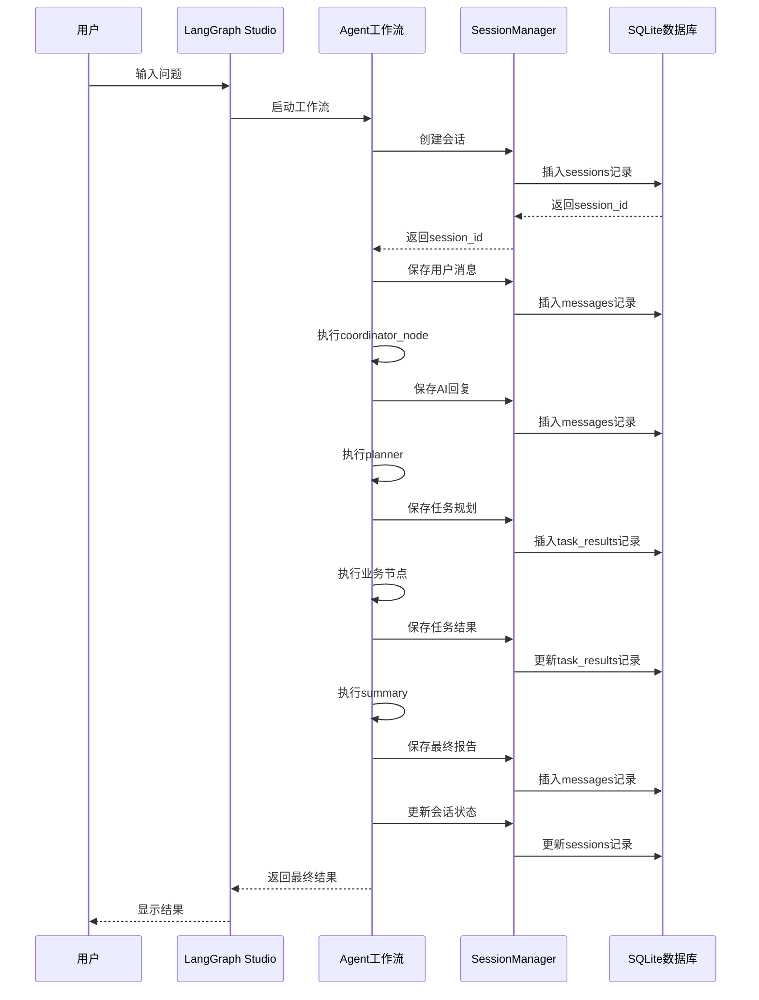
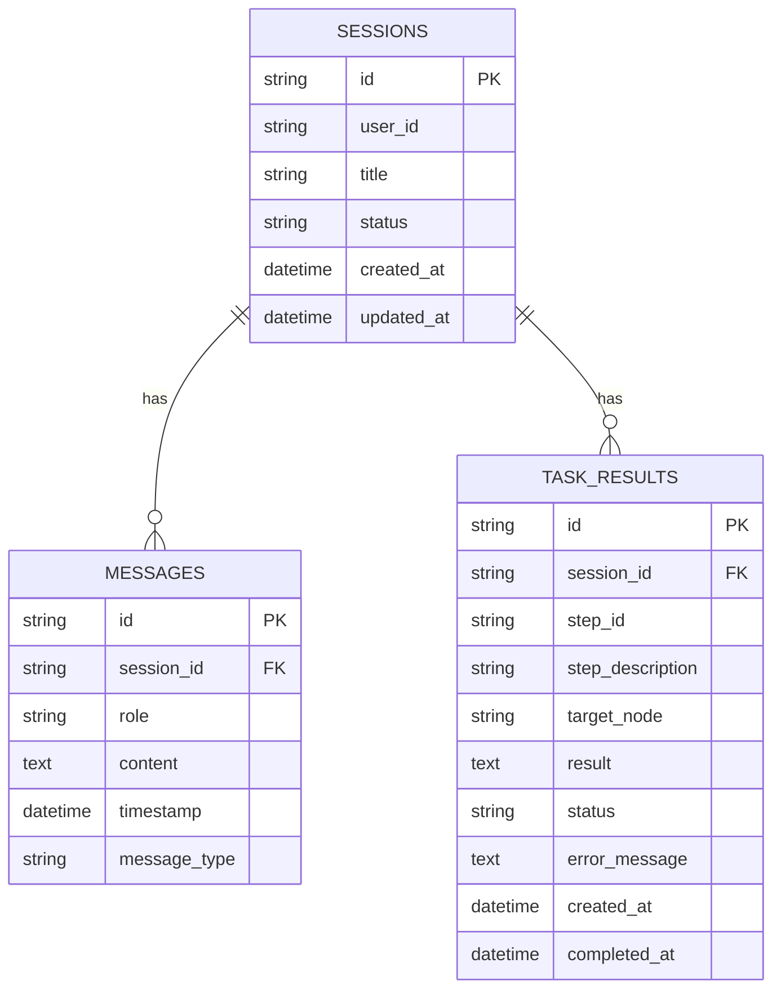
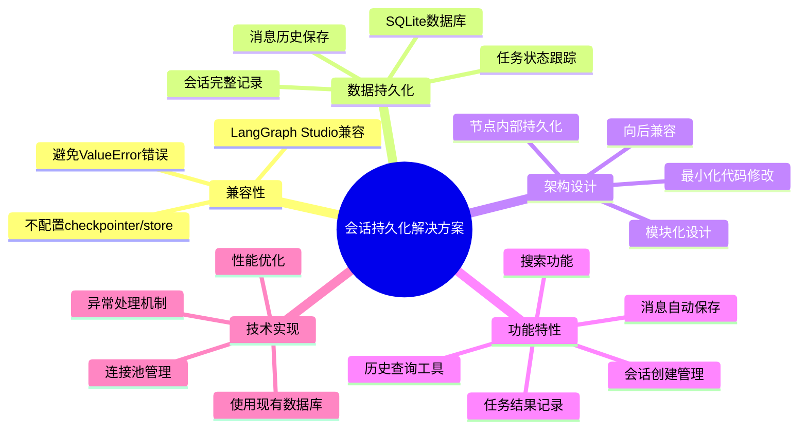

# 会话持久化架构图

## 整体架构

```mermaid
graph TB
    subgraph "用户交互层"
        A[用户输入] --> B[LangGraph Studio]
        B --> C[Agent工作流]
    end
    
    subgraph "LangGraph工作流"
        C --> D[coordinator_node]
        D --> E[planner]
        E --> F[业务节点]
        F --> G[summary]
        G --> H[END]
    end
    
    subgraph "数据持久化层"
        I[SessionManager] --> J[SQLite数据库]
        J --> K[sessions表]
        J --> L[messages表]
        J --> M[task_results表]
    end
    
    subgraph "节点持久化集成"
        D --> N[创建会话]
        D --> O[保存用户消息]
        D --> P[保存AI回复]
        E --> Q[保存任务规划]
        F --> R[保存任务结果]
        G --> S[保存最终报告]
        G --> T[更新会话状态]
    end
    
    subgraph "查询工具"
        U[query_sessions.py] --> V[会话列表查询]
        U --> W[会话详情查询]
        U --> X[会话搜索]
    end
    
    %% 连接关系
    N --> I
    O --> I
    P --> I
    Q --> I
    R --> I
    S --> I
    T --> I
    
    V --> I
    W --> I
    X --> I
    
    %% 样式
    classDef userLayer fill:#e1f5fe,stroke:#01579b,stroke-width:2px
    classDef workflowLayer fill:#f3e5f5,stroke:#4a148c,stroke-width:2px
    classDef dataLayer fill:#e8f5e8,stroke:#1b5e20,stroke-width:2px
    classDef persistenceLayer fill:#fff3e0,stroke:#e65100,stroke-width:2px
    classDef toolLayer fill:#fce4ec,stroke:#880e4f,stroke-width:2px
    
    class A,B,C userLayer
    class D,E,F,G,H workflowLayer
    class I,J,K,L,M dataLayer
    class N,O,P,Q,R,S,T persistenceLayer
    class U,V,W,X toolLayer
```

## 数据流图

```mermaid
sequenceDiagram
    participant U as 用户
    participant S as LangGraph Studio
    participant A as Agent工作流
    participant SM as SessionManager
    participant DB as SQLite数据库
    
    U->>S: 输入问题
    S->>A: 启动工作流
    
    A->>SM: 创建会话
    SM->>DB: 插入sessions记录
    DB-->>SM: 返回session_id
    SM-->>A: 返回session_id
    
    A->>SM: 保存用户消息
    SM->>DB: 插入messages记录
    
    A->>A: 执行coordinator_node
    A->>SM: 保存AI回复
    SM->>DB: 插入messages记录
    
    A->>A: 执行planner
    A->>SM: 保存任务规划
    SM->>DB: 插入task_results记录
    
    A->>A: 执行业务节点
    A->>SM: 保存任务结果
    SM->>DB: 更新task_results记录
    
    A->>A: 执行summary
    A->>SM: 保存最终报告
    SM->>DB: 插入messages记录
    A->>SM: 更新会话状态
    SM->>DB: 更新sessions记录
    
    A-->>S: 返回最终结果
    S-->>U: 显示结果
```

## 数据库关系图

```mermaid
erDiagram
    SESSIONS ||--o{ MESSAGES : "has"
    SESSIONS ||--o{ TASK_RESULTS : "has"
    
    SESSIONS {
        string id PK
        string user_id
        string title
        string status
        datetime created_at
        datetime updated_at
    }
    
    MESSAGES {
        string id PK
        string session_id FK
        string role
        text content
        datetime timestamp
        string message_type
    }
    
    TASK_RESULTS {
        string id PK
        string session_id FK
        string step_id
        string step_description
        string target_node
        text result
        string status
        text error_message
        datetime created_at
        datetime completed_at
    }
```

## 解决方案优势

```mermaid
mindmap
  root((会话持久化解决方案))
    兼容性
      LangGraph Studio兼容
      不配置checkpointer/store
      避免ValueError错误
    数据持久化
      SQLite数据库
      会话完整记录
      任务状态跟踪
      消息历史保存
    架构设计
      节点内部持久化
      最小化代码修改
      向后兼容
      模块化设计
    功能特性
      会话创建管理
      消息自动保存
      任务结果记录
      历史查询工具
      搜索功能
    技术实现
      使用现有数据库
      异常处理机制
      连接池管理
      性能优化
```
