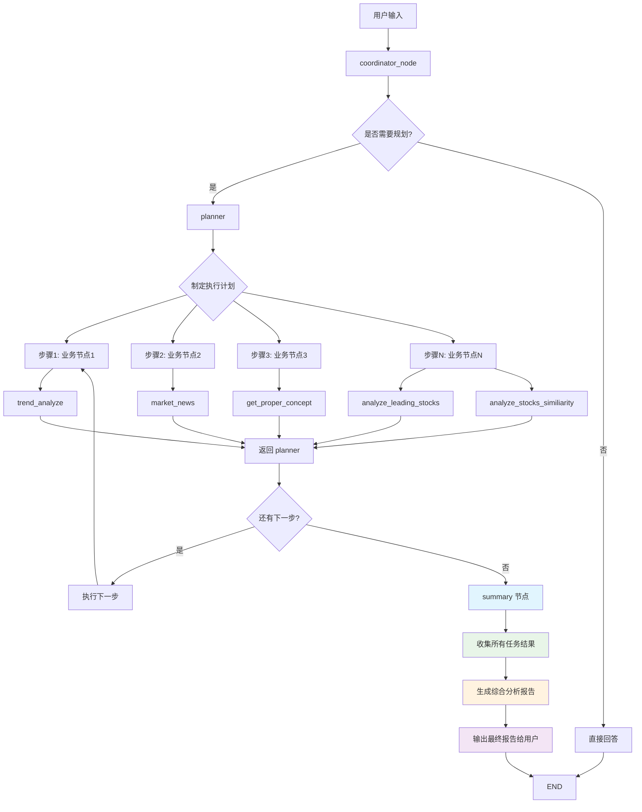

# Summary 节点工作流程图

## 新增的 Summary 节点工作流程

## Summary 节点功能说明

### 1. 数据收集
- 收集所有已完成步骤的结果
- 识别失败的任务
- 构建任务结果摘要

### 2. 报告生成
- **执行摘要**: 简要概述核心发现
- **关键发现**: 列出最重要的发现和结论
- **投资建议**: 基于分析结果给出具体建议
- **风险提示**: 识别潜在风险点
- **后续关注**: 建议用户后续关注的事项
- **详细分析**: 对各个任务结果进行深入分析

### 3. 输出格式
- 结构化的 Markdown 报告
- 包含时间戳和任务统计
- 专业的投资分析报告格式

## 工作流程改进

1. **完整闭环**: 从任务规划到最终总结的完整流程
2. **智能总结**: 基于所有任务结果生成专业报告
3. **用户友好**: 提供结构化的最终输出
4. **可扩展性**: 支持多种分析任务的综合总结
